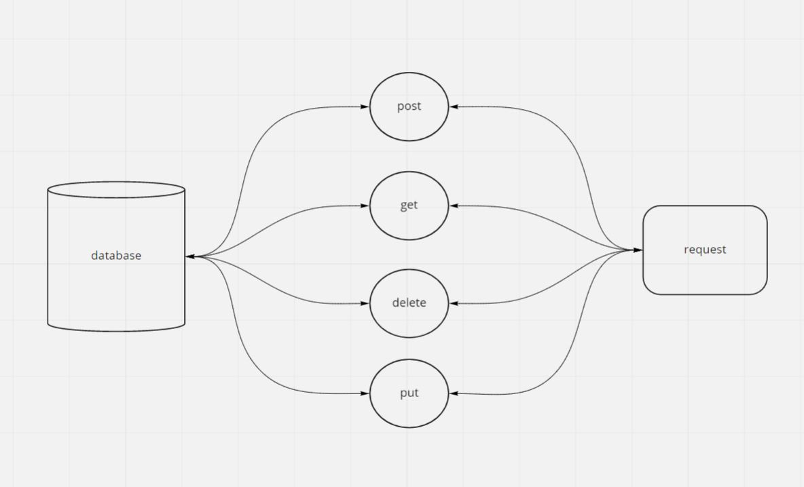

# serverless-api
## Root URL:  
**root url**: https://7m0dab8b66.execute-api.us-east-1.amazonaws.com/  

## end points:  
POST method : https://7m0dab8b66.execute-api.us-east-1.amazonaws.com/people/
GET method : https://7m0dab8b66.execute-api.us-east-1.amazonaws.com/people/
GET method : https://7m0dab8b66.execute-api.us-east-1.amazonaws.com/people/{id}
DELETE method : https://7m0dab8b66.execute-api.us-east-1.amazonaws.com/people/{id}
PUT method : https://7m0dab8b66.execute-api.us-east-1.amazonaws.com/people/{id}
## inputs:  
post requires a body.  

put requires a body.

the get and delete reuqiers no input.
## outputs:  
get returns the records in the database.  
delete returns an empty object.  
put reutrns the modified record.  
post reutrns the added record.  
## pul Request Link: [https://github.com/awwadsaeed/serverless-api/pull/1](https://github.com/awwadsaeed/serverless-api/pull/1)  
## UML:  

